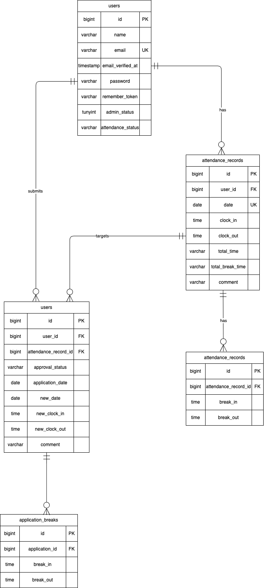

# Attendance

## 概要
ユーザーの出勤・勤怠・休憩時間を記録し、勤怠情報を管理するWebアプリケーションです。

## 使用技術

### Backend
・PHP7.4.9
・Laravel 8
・MySQL8.0.26

### Frontend
・HTML
・CSS
・Blade

### Environment
・Docker
・Docker Compose
・Nginx

## 機能一覧

### 一般ユーザー
・会員登録
・ログイン・ログアウト
・出勤・退勤の記録
・休憩開始・終了の記録
・当日の勤怠情報の確認
・勤怠一覧の確認
・勤怠詳細の確認

### 管理者
・管理者のログイン
・ユーザーの勤怠一覧情報確認
・勤怠情報の管理
※実際に実装している機能に合わせて調整してください。

## 環境構築

### 1.リポジトリのクローン
```
git clone git@github.com:ayaka-1995/Attendance.git
cd Attendance
```

### 2. Dockerコンテナを起動
```
docker-compose up -d
```

### 3.PHPコンテナに入る
```
docker-compose exec php bash
```

### 4.Composer install
```
composer install
```

### 5.envファイルを作成
```
cp .env.example .env
```
環境に合わせてDB接続情報を設定してください

### 6.アプリケーションキーを生成
```
php artisan key:generate
```

### 7.マイグレーション
```
php artisan migrate
```

### 8.必要に応じて初期データを登録
```
php artisan db:seed
```


## アプリケーションURL
```
http://localhost/
```

## テスト実行
```
php artisan test
```


## テーブル仕様

### users テーブル

| カラム名          | 型           | primary key | unique key | not null | foreign key |
| ----------------- | ------------ | ----------- | ---------- | -------- | ----------- |
| id                | bigint       | ◯           |            | ◯        |             |
| name              | varchar(255) |             |            | ◯        |             |
| email             | varchar(255) |             | ◯          | ◯        |             |
| email_verified_at | timestamp    |             |            |          |             |
| password          | varchar(255) |             |            | ◯        |             |
| remember_token    | varchar(100) |             |            |          |             |
| created_at        | timestamp    |             |            |          |             |
| updated_at        | timestamp    |             |            |          |             |
| admin_status      | tinyint      |             |            | ◯        |             |
| attendance_status | varchar(255) |             |            | ◯        |             |

### attendance_records テーブル

| カラム名         | 型           | primary key | unique key | not null | foreign key |
| ---------------- | ------------ | ----------- | ---------- | -------- | ----------- |
| id               | bigint       | ◯           |            | ◯        |             |
| user_id          | bigint       |             |            | ◯        | users(id)   |
| date             | date         |             |            | ◯        |             |
| clock_in         | time         |             |            | ◯        |             |
| clock_out        | time         |             |            |          |             |
| total_time       | varchar(255) |             |            |          |             |
| total_break_time | varchar(255) |             |            |          |             |
| comment          | varchar(255) |             |            |          |             |
| created_at       | timestamp    |             |            |          |             |
| updated_at       | timestamp    |             |            |          |             |

### breaks テーブル

| カラム名             | 型        | primary key | unique key | not null | foreign key            |
| -------------------- | --------- | ----------- | ---------- | -------- | ---------------------- |
| id                   | bigint    | ◯           |            | ◯        |                        |
| attendance_record_id | bigint    |             |            | ◯        | attendance_records(id) |
| break_in             | time      |             |            | ◯        |                        |
| break_out            | time      |             |            |          |                        |
| created_at           | timestamp |             |            |          |                        |
| updated_at           | timestamp |             |            |          |                        |

### applications テーブル

| カラム名             | 型           | primary key | unique key | not null | foreign key            |
| -------------------- | ------------ | ----------- | ---------- | -------- | ---------------------- |
| id                   | bigint       | ◯           |            | ◯        |                        |
| user_id              | bigint       |             |            | ◯        | users(id)              |
| attendance_record_id | bigint       |             |            | ◯        | attendance_records(id) |
| approval_status      | varchar(255) |             |            | ◯        |                        |
| application_date     | date         |             |            | ◯        |                        |
| new_date             | date         |             |            | ◯        |                        |
| new_clock_in         | time         |             |            | ◯        |                        |
| new_clock_out        | time         |             |            | ◯        |                        |
| comment              | varchar(255) |             |            | ◯        |                        |
| created_at           | timestamp    |             |            |          |                        |
| updated_at           | timestamp    |             |            |          |                        |

### application_breaks テーブル

| カラム名       | 型        | primary key | unique key | not null | foreign key      |
| -------------- | --------- | ----------- | ---------- | -------- | ---------------- |
| id             | bigint    | ◯           |            | ◯        |                  |
| application_id | bigint    |             |            | ◯        | applications(id) |
| break_in       | time      |             |            | ◯        |                  |
| break_out      | time      |             |            |          |                  |
| created_at     | timestamp |             |            |          |                  |
| updated_at     | timestamp |             |            |          |                  |

## ER 図


### ログイン情報
一般ユーザー
    id: user1@example.com/user2@example.com
    pass:password
管理者
    id: user3@example.com
    pass:password

### URL

・開発環境:http://localhost/
・phpMyAdmin:http://localhost:8080/

## 工夫した点
- Docker Composeを使用して開発環境を構築
- 出勤・退勤・休憩の状態を管理し、ユーザーが現在の勤怠状況を確認できるようにした
- 勤怠情報を日付ごとに確認できるようにした
- バリデーションを実装し、不正な入力を防止した